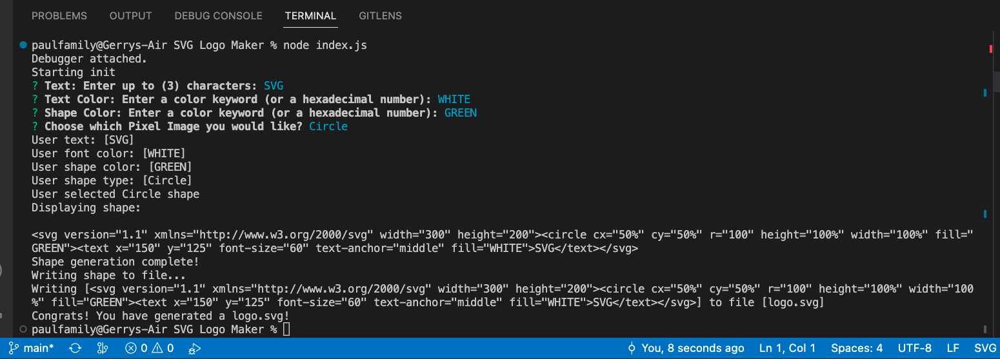
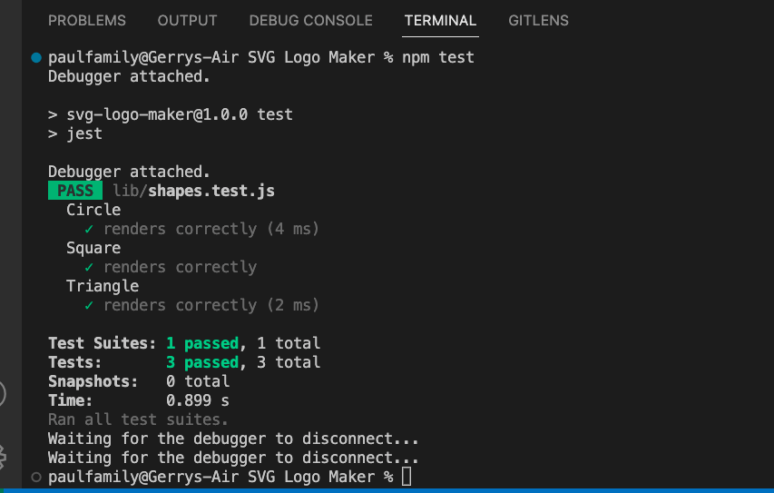

# OOP SVG-Logo-Maker

## Description:

The application enables users to enter inputs into a inquirer prompt in order to generate a logo "logo.svg" file which contains the users desired results as an SVG image.

## Table of Contents:

- [Overview](#Overview)
- [The Challenge](#The-Challenge)
- [Usage Information](#Usage-Information)
- [Installation Process](#Installation-Process)
- [Built With](#Built-With)
- [What I Learned](#What-I-Learned)
- [Continued Development](#Continued-Development)
- [License](#License)
- [Author](#Author)
- [Acknowledgments](#Acknowledgments)

# Overview

## The Challenge:

Build a Node.js command-line application that takes in user inputs to generates a SVG logo and saves it as "logo.svg" file. In addition, create a walkthrough video that demonstrates its functionality and the passing of all of the tests.

## Usage Instructions

1. Open the cloned repository in any source code editor e.g. Visual Studio Code.
2. Open integrated terminal on index.js
3. Enter “node index.js” in the command line
4. Through sequential order within the command line interface - the user will be presented with npm inquirer questions - the user will provide a response to each question and proceed.
5. Once completed a SVG file named "logo.svg" will be created.
6. At your discretion, you may rename the "logo.svg" file to the file name of your choice.

## Solution URL:

[Solution URL Link:](https://github.com/gpaul12/SVG-Logo-Maker)

## Walkthrough Video:

[Click Here to Watch]()

## Screenshots:

### Figure 1. Command line application

### Figure 2. Jest Testing "npm test"

### Figure 3. Generated "logo.svg" file

## Installation Process

1. Clone the repository: [SVG Logo Maker](https://github.com/gpaul12/SVG-Logo-Maker)
2. Install the following:

- Node.JS [Version 16.18.1](https://nodejs.org/en/blog/release/v16.18.1/)
- Jest [Version 29.4.3](https://www.npmjs.com/package/jest)
- Inquirer.js: [Version 8.2.4](https://www.npmjs.com/package/inquirer/v/8.2.4)

3. Open the cloned repository in any source code editor.
4. Open the integrated terminal for the document and complete the respective installation guides provided above in section (2.) to ensure the cloned documentation will operate.

## Built With

- Dynamic JavaScript
- Node.js [Version 16.18.1](https://nodejs.org/en/blog/release/v16.18.1/)
- Jest [Version 29.4.3](https://www.npmjs.com/package/jest)
- Inquirer.js: [Version 8.2.4](https://www.npmjs.com/package/inquirer/v/8.2.4)
- Visual Studio Code: [Website](https://code.visualstudio.com/)

### Copyright © 2023 Gerry Paul

## Author

Follow me on Github at [gpaul12](https://github.com/gpaul12)! Additional questions or concerns? feel free to contact me at gpaul12@nc.rr.com.

See you soon!

© 2023 [gpaul12](https://github.com/gpaul12). Confidential and Proprietary. All Rights Reserved.
